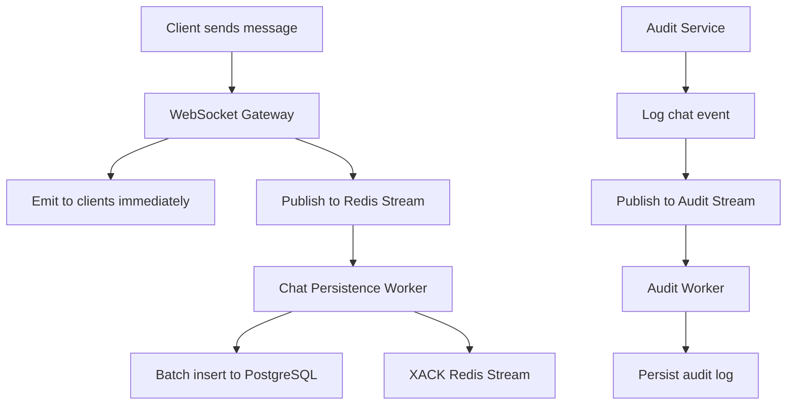
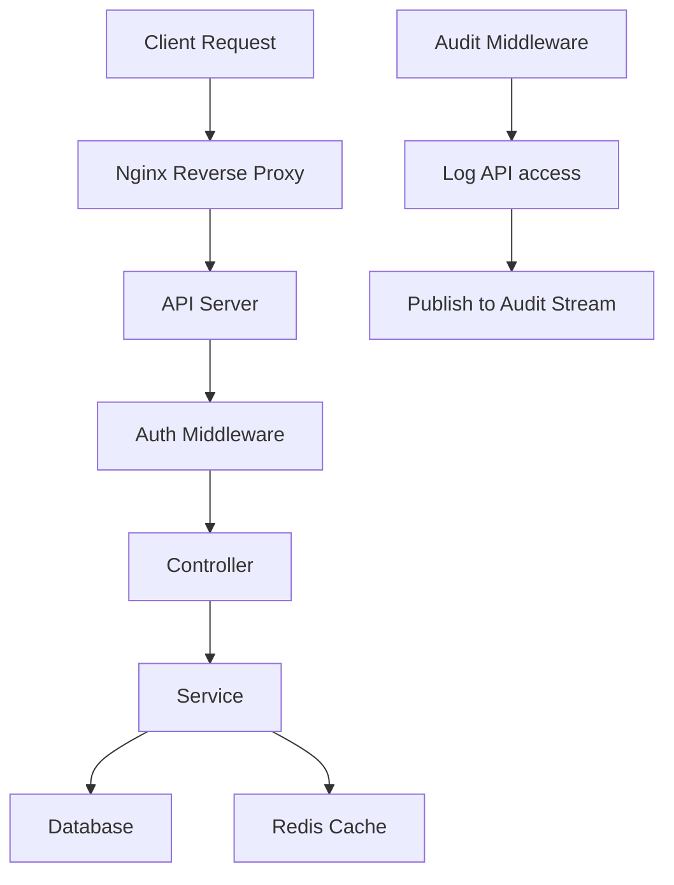

# 🏗️ ShopApp Backend Architecture

## 📋 Tổng quan

ShopApp Backend được thiết kế với kiến trúc tách biệt API và Worker, sử dụng Redis Streams để giao tiếp bất đồng bộ. Điều này cho phép scale độc lập và chuẩn bị cho việc chuyển đổi sang microservice trong tương lai.

## 🎯 Kiến trúc Hệ thống

### 1. **API Server** (`main.ts`)
- **Chức năng**: Xử lý HTTP requests, WebSocket connections
- **Port**: 4000
- **Công nghệ**: NestJS, Socket.IO, JWT Auth
- **Tính năng**:
  - REST API endpoints
  - WebSocket Gateway cho chat real-time
  - Authentication & Authorization
  - File upload
  - API documentation (Swagger)

### 2. **Worker Service** (`worker.ts`)
- **Chức năng**: Xử lý background tasks
- **Công nghệ**: NestJS Application Context
- **Tính năng**:
  - Chat message persistence
  - Audit log processing
  - Data synchronization
  - Queue processing

### 3. **Redis Streams**
- **Chức năng**: Message broker giữa API và Worker
- **Streams**:
  - `chat_stream`: Chat messages
  - `audit_stream`: Audit events
- **Consumer Groups**: Đảm bảo message processing reliability

## 🔄 Luồng Xử lý

### Chat Message Flow


### API Request Flow


## 📁 Cấu trúc Project

```
src/
├── main.ts                          # API Server entrypoint
├── worker.ts                        # Worker Service entrypoint
├── health-check.ts                  # Docker health check
├── modules/
│   ├── auth/                        # Authentication & Authorization
│   ├── users/                       # User management
│   ├── partners/                    # Partner management
│   ├── services/                    # Beauty services
│   ├── appointments/                # Appointment booking
│   ├── reviews/                     # Review & rating system
│   ├── dashboard/                   # Analytics & statistics
│   ├── chat/                        # Real-time messaging
│   │   ├── chat.gateway.ts         # WebSocket Gateway
│   │   ├── chat.service.ts         # Chat business logic
│   │   └── chat.controller.ts      # REST endpoints
│   ├── notifications/               # Notification system
│   ├── file-upload/                 # File management
│   ├── audit/                       # Audit logging
│   │   ├── audit.service.ts        # Audit service
│   │   ├── audit.controller.ts     # Audit API
│   │   └── audit.module.ts         # Audit module
│   ├── prisma/                      # Database service
│   ├── logger/                      # Logging service
│   └── common/                      # Shared utilities
│       ├── redis/                   # Redis service
│       │   ├── redis.service.ts    # Redis client wrapper
│       │   └── redis.module.ts     # Redis module
│       ├── config/                  # Configuration
│       ├── interceptors/            # Request/Response interceptors
│       ├── middleware/              # Custom middleware
│       │   └── audit.middleware.ts # API audit middleware
│       └── pagination/              # Pagination utilities
├── worker/
│   ├── worker.module.ts             # Worker module
│   ├── chat-persistence.worker.ts  # Chat message worker
│   └── audit.worker.ts             # Audit log worker
└── app.module.ts                    # Root module
```

## 🗄️ Database Schema

### Core Tables
- **users**: User accounts và OAuth information
- **sessions**: JWT refresh tokens
- **partners**: Beauty salon partners
- **services**: Beauty services offered
- **appointments**: Booking appointments
- **reviews**: Service reviews và ratings

### Chat Tables
- **rooms**: Chat rooms (direct, group, support)
- **chat_messages**: Chat messages với status tracking

### Audit Tables
- **audit_logs**: System audit trail
- **notifications**: User notifications
- **files**: File upload metadata

## 🚀 Deployment

### Development
```bash
# Start development environment
docker-compose -f docker-compose.dev.yml up -d

# Run API server
npm run start:dev

# Run Worker service
npm run start:worker:dev
```

### Production
```bash
# Build và start production environment
docker-compose up -d

# Check logs
docker-compose logs -f api
docker-compose logs -f worker
```

## 🔧 Configuration

### Environment Variables
- **Database**: `DATABASE_URL`
- **Redis**: `REDIS_URL`
- **JWT**: `JWT_SECRET`, `JWT_EXPIRES_IN`
- **OAuth**: Google, Facebook, GitHub, LINE, Instagram
- **AWS S3**: File storage configuration
- **Worker**: Batch sizes và processing intervals

### Docker Services
- **postgres**: PostgreSQL database
- **redis**: Redis cache và streams
- **api**: Main API server
- **worker**: Background worker service
- **nginx**: Reverse proxy (optional)

## 📊 Monitoring & Logging

### Health Checks
- API server health endpoint
- Worker process monitoring
- Database connectivity
- Redis connectivity

### Logging
- Winston logger với multiple transports
- Structured logging với correlation IDs
- Separate log files cho API và Worker

### Metrics
- Request/response times
- Message processing rates
- Error rates và success rates
- Database query performance

## 🔒 Security

### Authentication
- JWT tokens với refresh mechanism
- OAuth integration (Google, Facebook, etc.)
- Role-based access control (RBAC)

### API Security
- Rate limiting
- CORS configuration
- Helmet security headers
- Input validation và sanitization

### Data Protection
- Password hashing với bcrypt
- Sensitive data redaction trong logs
- SQL injection prevention với Prisma

## 🚀 Scaling Strategy

### Horizontal Scaling
- **API Server**: Scale theo traffic với load balancer
- **Worker Service**: Scale theo backlog size
- **Database**: Read replicas cho read-heavy workloads
- **Redis**: Redis Cluster cho high availability

### Microservice Migration Path
1. **Current**: Monolithic với separated workers
2. **Phase 1**: Extract chat service
3. **Phase 2**: Extract audit service
4. **Phase 3**: Extract notification service
5. **Phase 4**: Full microservice architecture

### Performance Optimization
- Database indexing
- Redis caching strategy
- Connection pooling
- Batch processing
- Message compression

## 🧪 Testing Strategy

### Unit Tests
- Service layer testing
- Worker logic testing
- Utility function testing

### Integration Tests
- API endpoint testing
- Database integration testing
- Redis stream testing

### E2E Tests
- Complete user workflows
- Chat functionality testing
- Authentication flows

## 📈 Future Enhancements

### Planned Features
- Real-time analytics dashboard
- Advanced notification system
- File processing workers
- Email/SMS integration
- Payment processing
- Advanced audit reporting

### Technical Improvements
- GraphQL API layer
- Event sourcing
- CQRS pattern
- Advanced caching strategies
- Performance monitoring
- Automated testing pipeline
