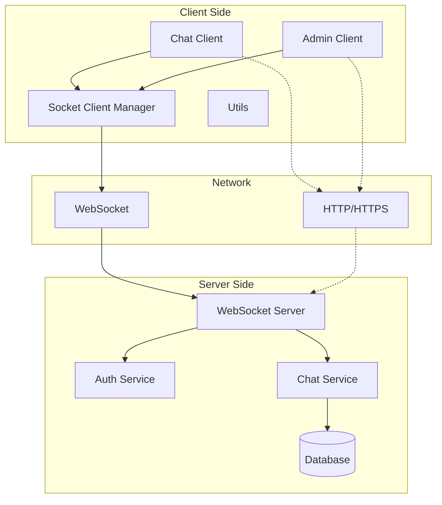
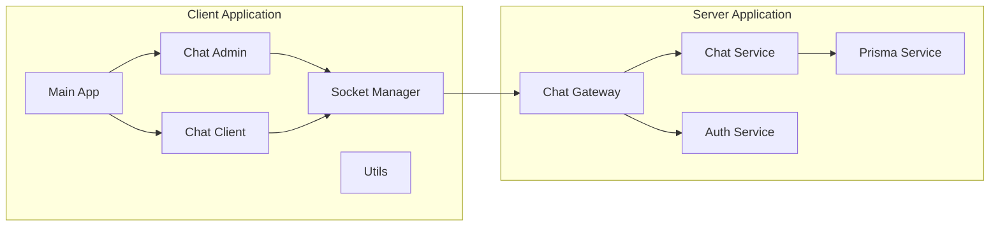
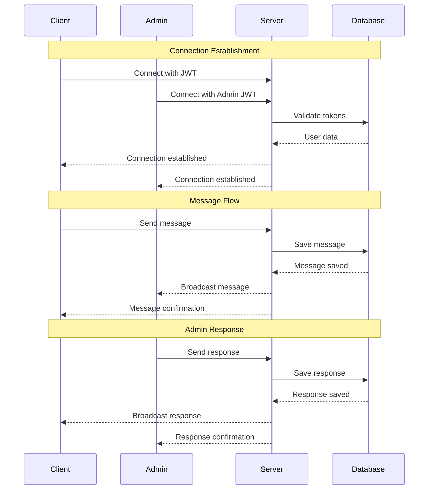
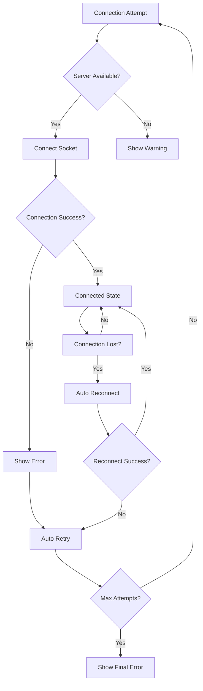
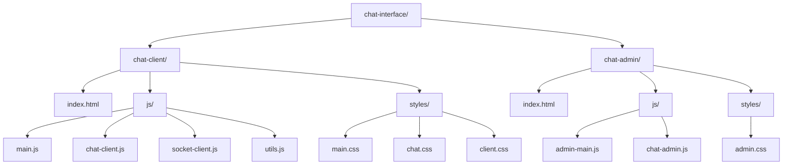
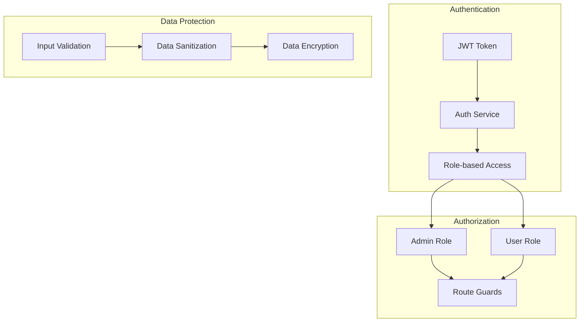

# Chat WebSocket Architecture

## System Overview

## Component Architecture

## Data Flow

## Error Handling Flow

## File Structure

## Security Model

## Performance Considerations

### Client-side Optimization
- Lazy loading of components
- Message pagination
- Efficient DOM updates
- Connection pooling
- Offline support with message queuing

### Server-side Optimization
- Connection management
- Message batching
- Database indexing
- Caching strategies
- Rate limiting

### Network Optimization
- WebSocket compression
- Message compression
- Connection multiplexing
- Keep-alive mechanisms
